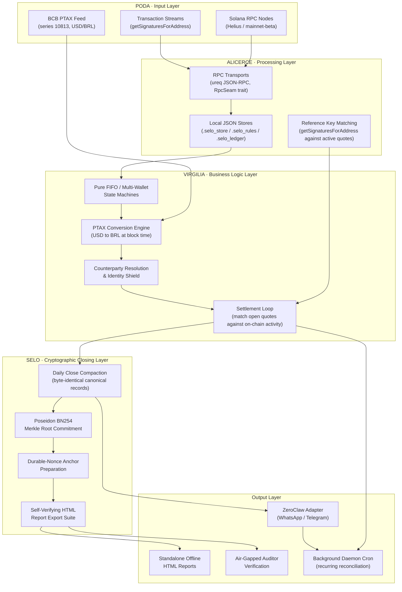

<p align="center"></p>

## SELO · Pure-Rust Cryptographic Accounting & ZK Audit Engine

Selo is a pure-Rust, transport-agnostic cryptographic accounting engine built
for stablecoin income reporting, multi-wallet FIFO tax lot tracking, air-gapped
auditor verification, and deterministic daily closes on Solana. It ships as a
single stock release binary -- no WASM, no plugins, no compiler required.

### Core Architectural Philosophy

Strict Dependency Inversion: pure business logic, tax lot state machines, and
ZK commitment math live exclusively inside selo-core with zero network or I/O
dependencies. Network transport, storage drivers, and CLI interaction reside
strictly in selo-tool.

Brain and Hands Pattern: the Brain (selo-core) processes identification, net
deltas across any DeFi protocol, PTAX fiat valuations, and Poseidon Merkle
trees. The Hands (selo-tool) handle Solana JSON-RPC I/O via ureq, local disk
persistence, and monochrome split-seal report rendering.

### Architecture: One Surface

A user installs the stock ZeroClaw binary, adds config
and skills, and the selo binary runs the money path. Reading and matching are
custody T0 with no key. The period anchor and refunds render an unsigned
transaction that a human signs (T1), using a durable nonce so it never expires
while waiting. One implementation, one threat model, one place to audit.

The full comparison is in `notes/architecture-comparison.html`.

### System Architecture



### How It Handles High-Volume DeFi Protocols

The ingestion engine reads every transaction through net deltas: it computes
`Post-Balance - Pre-Balance` at the transaction boundary and ignores
everything that happened inside. This is protocol-agnostic. A Meteora DLMM
yield harvest, a Jupiter Perps PnL settlement, a Drift funding payment, an
Orca Whirlpool rebalance -- all of them collapse to a single net delta per
mint per transaction. No instruction-level parsing, no protocol-specific code.

Combined with the ingest checkpointing (each signature is saved to disk as it
is processed), a wallet with thousands of DeFi transactions can be ingested in
sessions. If it crashes at transaction 7,000 of 12,000, the next run resumes
at 7,001 rather than restarting from zero.

The tax lot book is integer-exact. Ingest persists the raw ledger events and
rebuilds the FIFO/HIFO `LotBook` from them on every run, so an interrupted
ingest resumes by re-deriving the same book rather than mutating a partial
one: positions are never destroyed by a re-run, disposals are atomic, and
the oldest acquisition is always consumed first regardless of arrival order.
Resolved PTAX and SOL/USD rates are persisted alongside the events, so a live
feed that succeeds today and is rate-limited tomorrow cannot quietly change
the ledger; the book is deterministic and offline after the first ingest.
A stored rate that is missing or zero is treated as a miss and re-resolved,
and every rate is floored at the documented historical PTAX, so a broken
feed can never multiply cost basis by zero.

By default every outbound transfer to a classified counterparty is booked as
a capital disposal, and a payment with no same-transaction income realizes a
full loss. Run `selo-tool ingest <pubkey> --all --payments-as-expenses` to
adopt the alternative policy: payments to counterparties are treated as
operating expenses. The position is still reduced, but no capital loss is
booked and nothing reaches the gains report or the tax calculation. Only
swaps (an expense with income in the same transaction) remain capital
disposals. The choice is persisted on the ledger.

### Master Roadmap and Phases

- [x] **Phase 1: Poda (Stages 1-3)** -- Workspace cleanup and crate separation (selo-core and selo-tool)
- [x] **Phase 2: Alicerce (Stages 4-5)** -- Foundational RPC infrastructure (RpcSeam and ureq) and persistence
- [x] **Phase 3: Virgilia (Stages 6-9)** -- Ledger Intelligence, Solana Pay URIs, PDA derivation, and counterparty auto-labeling
- [x] **Phase 4: Selo (Stages 10-12)** -- Deterministic Daily Closes, Poseidon BN254 Commitments, Identity Shield, Self-Verifying HTML Audit Reports, Ingest Checkpointing, Per-Wallet Date-Ranged Reports

### Developer Quickstart and CLI Command Reference

#### 1. Execute Offline Workspace Tests

```powershell
cargo test --workspace
```

287 tests, all in selo-core. No test requires a network connection or a
running node.

#### 2. Query Account Balance and Counterparty Resolution

Selo supports human-readable counterparty names across all wallet inputs:

```powershell
cargo run -p selo-tool -- balance "Relayer"
cargo run -p selo-tool -- balance 7Xw19aK4mQ2vB8pY3zN6jR5wL8kQ9tM4sP2vX1yZ3kL9
```

#### 3. Payment Intent and On-Chain Reconciliation

```powershell
# Issue a payment intent quote with single-use reference key:
cargo run -p selo-tool -- issue --amount 500000000 --recipient <PUBKEY> --label "Design Work"

# Scan cluster for settlements matching stored reference keys:
cargo run -p selo-tool -- confirm
```

#### 4. Ledger Intelligence: Ingestion, Checkpointing, and Counterparty Review

```powershell
# Manage counterparty mapping rules:
cargo run -p selo-tool -- rules --add <PUBKEY> --name "Client Escrow"

# Ingest transaction history with automatic checkpointing.
# If interrupted, the next run resumes from the last processed signature:
cargo run -p selo-tool -- ingest <PUBKEY> --all

# Filter by date range:
cargo run -p selo-tool -- ingest <PUBKEY> --since 2026-01-01 --before 2026-12-31

# Surface unclassified counterparty addresses needing review:
cargo run -p selo-tool -- review <PUBKEY>
```

The ingest command saves after every transaction. A wallet with thousands of
DLMM, perp DEX, or AMM transactions can be ingested across sessions. Already
processed signatures are skipped on resume.

#### 5. Deterministic Daily Close and ZK Commitment

```powershell
cargo run -p selo-tool -- close --merchant <PUBKEY> --start 1750000000 --end 1750086400 --output daily_audit.txt
```

#### 6. Standalone HTML Audit Report Export and Verification

```powershell
# Export self-verifying HTML audit report for a fiscal year:
cargo run -p selo-tool -- export-html --year 2026 --output audit_statement.html

# Per-wallet report:
cargo run -p selo-tool -- export-html --year 2026 --wallet <PUBKEY> --output wallet_audit.html

# Date-range scoped report:
cargo run -p selo-tool -- export-html --year 2026 --from 2026-01-01 --to 2026-06-30 --output h1_audit.html

# Verify local tax ledger against a cryptographic Poseidon BN254 root:
cargo run -p selo-tool -- verify --root 0x09be3021160dce395ebe3617c382a8adba...
```

#### 7. PTAX Exchange Rate

```powershell
# Fetch live BCB PTAX rate and historical baseline:
cargo run -p selo-tool -- ptax
```

The BCB SGS API (series 10813) is queried for the current USD/BRL rate. For
stablecoins (USDC, USDT, PYUSD) the cost basis formula `amount * PTAX` is
correct because 1 stablecoin is approximately 1 USD. For volatile assets like
SOL, `fetch_sol_brl_price()` in `ptax.rs` combines a live SOL/USD price from
Jupiter's price API (`https://lite-api.jup.ag/price/v3`) with the BCB USD/BRL
PTAX rate to produce a SOL/BRL price for oracle-derived cost basis entries.
When either feed is unreachable, it falls back to historical defaults
(`DEFAULT_HISTORICAL_SOL_USD = 20.00` and `DEFAULT_HISTORICAL_PTAX = 5.0500`),
and the `is_live` flag in the return value lets the caller distinguish a live
price from a fallback.

Historical SOL/USD for backfilled dates is resolved from two independent
sources in `selo-tool`: CoinGecko's daily history endpoint first, then
Binance's daily kline close for the same UTC day. Resolved rates are persisted
on the ledger alongside the events, so a feed that is rate-limited or offline
on one run cannot silently change the cost basis on a later one; the book is
deterministic and offline after the first ingest. SOL historical prices in a
ledger that was built before this cascade (or under the fallback constant) can
be corrected by re-resolving the affected dates against Binance and re-running
ingest.

### ZeroClaw Integration

Selo runs two channel surfaces through ZeroClaw, configured in `zeroclaw.toml`:

**Telegram (primary operations harness).** The adapter at
`adapters/telegram/main.py` is the main control surface. It provides command
routing with admin gating, built-in cron scheduling (daily close at 23:00,
hourly health checks, monthly reconciliation), a settlement watcher with
signature deduplication, confirm-token gates for destructive operations, and
progress streaming for long-running ingest commands. It uses Telegram
long-polling -- no webhook or public URL required. Scheduling is owned by the
adapter, not by ZeroClaw's cron engine.

**WhatsApp (webhook bridge).** WhatsApp messages arrive via Meta Cloud API
webhook. ZeroClaw's built-in webhook server dispatches them to the selo skill
(`skills/selo/SKILL.toml`), which maps natural language to selo-tool
subcommands. Requires a Meta Business account and a public webhook URL.

Full setup instructions for both channels are in `adapters/README.md`.

### License

Licensed under Apache-2.0
